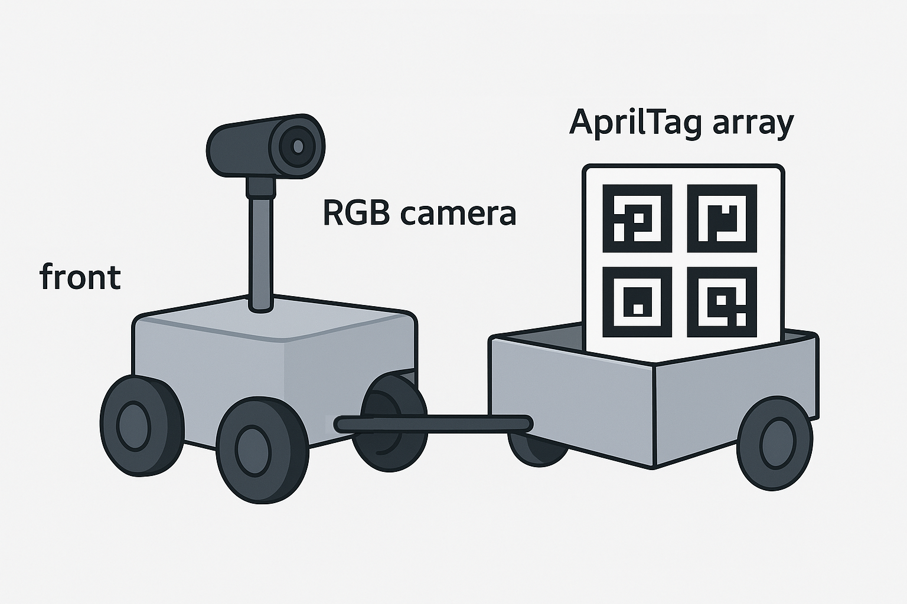

<h1 align='center' style="text-align:center; font-weight:bold; font-size:2.0em;letter-spacing:2.0px;"> hitch_estimation_apriltag_array </h1>

<p align="center">
  
</p>

The `hitch_estimation_apriltag_array` package is intended to estimate the angle between a mobile base and a cart that is hitched to its rear. The calculation is performed by estimating the 6DOF transform between a RGB camera assumed to be mounted at the rear of the mobile base and an array of April tags mounted at the front of the cart.


### Parameters

April tag sizes, frames, topics, etc are set in the launchers

- `apriltag_ros.launch.xml`
- `apriltag_array_pose_estimation.launch.xml`
- `hitch_joint_state_estimation.launch.xml`

### Launch

Estimate the angle between the mobile base and the trailer with

```bash
ros2 launch hitch_estimation_apriltag_array hitch_estimation_apriltag_array.launch.xml
```

Instead, if you wish to estimate only the transform of the April tag array with respect to the RGB camera, comment out the last include, namely

```xml
<include file="$(find-pkg-share hitch_estimation_apriltag_array)/launch/hitch_joint_state_estimation.launch.xml"/>
```
